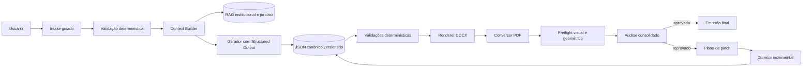

# Arquitetura alvo

## Componentes

1. **Intake Service:** coleta dados e gera pendências.
2. **Source Registry:** registra fontes, versões, validade e escopo.
3. **RAG Service:** busca híbrida com filtros.
4. **Context Builder:** seleciona e compacta o contexto sem LLM.
5. **Generation Service:** uma chamada por documento e saída estruturada.
6. **Canonical Document Store:** versionamento e hashes.
7. **Rule Engine:** validações objetivas.
8. **Renderer:** DOCX a partir de template institucional.
9. **PDF Pipeline:** conversão e inspeção.
10. **Audit Service:** auditoria semântica do bundle.
11. **Patch Service:** aplicação localizada e protegida.
12. **Workflow Engine:** estados, retries, bloqueios e feature flags.
13. **Observability:** logs, métricas, traces e custos.
